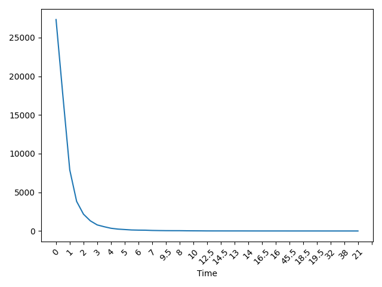
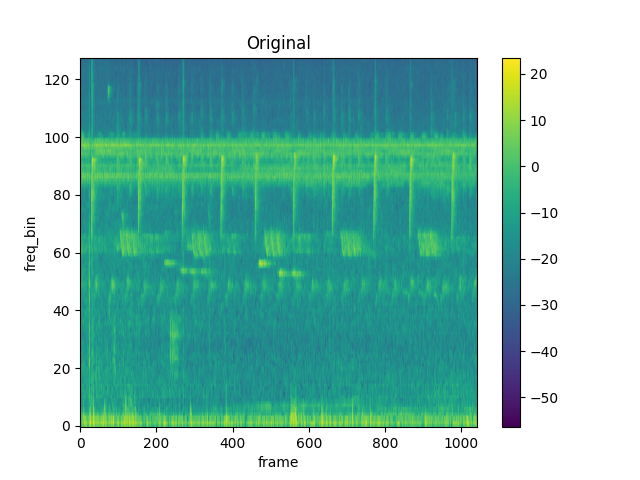
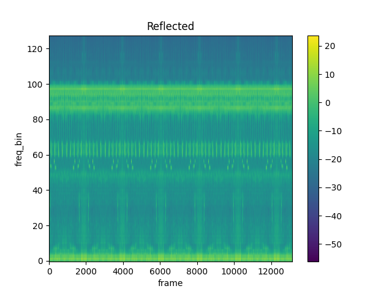

[comment]: <> (Birds' directories are not random, it is a species' code. )

[comment]: <> (You can just put it in sites as [eBird]&#40;https://ebird.org/species/scatan&#41; and [TheCornellLab]&#40;https://www.allaboutbirds.org/guide/scatan&#41; and see it yourself.)

[comment]: <> (eBird seems to be better.)

[comment]: <> (- [x] It seems that tensors are normalized between &#40;-1,1&#41;)

[comment]: <> (- [ ] Add some background knowledge in the report as )

[comment]: <> (  [here]&#40;https://medium.com/analytics-vidhya/audio-data-processing-feature-extraction-science-concepts-behind-them-be97fbd587d8&#41;, )

[comment]: <> (  [here]&#40;https://towardsdatascience.com/audio-deep-learning-made-simple-part-1-state-of-the-art-techniques-da1d3dff2504&#41;,)

[comment]: <> (  [here]&#40;https://towardsdatascience.com/detecting-sounds-with-deep-learning-ed9a41909da0&#41;)

[comment]: <> (  [melscale]&#40;https://importchris.medium.com/how-to-create-understand-mel-spectrograms-ff7634991056&#41;,)

[comment]: <> (  [mel spectrogram]&#40;https://medium.com/analytics-vidhya/understanding-the-mel-spectrogram-fca2afa2ce53&#41;,)

[comment]: <> (- [x] Try some preprocessing with different sample rate.)

[comment]: <> (- [x] Training in different times.)

[comment]: <> (- [x] Try resampling to a fixed size.)

[comment]: <> (- [x] A sample rate of 32000 means that in 1 second we have 32000 frames.)

[comment]: <> (- [x]  A radix major implementation for ResNet &#40;see paper&#41; was too problematic due to computation)

[comment]: <> (- [x] See Resnet paper 3.2 plain network recommendations.)

[comment]: <> (- [x] During validation soundscape datasets have been halved, birdcalls probably thirded.)

[comment]: <> (- [x] Occam's razor.)

[comment]: <> (- [x] When there are imbalances accuracy is useless.)

[comment]: <> (- [x] In birdcalls batches are too small.)

[comment]: <> (- [x] Future works add what you could have done with more resources.)

[comment]: <> (- [x] Future works: thresholding and secondary labels.)

[comment]: <> (- [x] Specify that models are trained on the seed, our goal is not to have a good on-the-wild ai.)

[comment]: <> (- [x] Soundscapes and Joint are divided following 80-10-10, Birdcalls according to a 70-15-15 split)

[comment]: <> (## Environment )

[comment]: <> (```)

[comment]: <> (conda create -n Birdcalls)

[comment]: <> (conda activate Birdcalls)

[comment]: <> (pip install -r requirements.txt)

[comment]: <> (```)

[comment]: <> (```)

[comment]: <> (./setup.sh -dmo)

[comment]: <> (```)

# Birdcalls

<p align="center">
    <a href="https://pytorch.org/get-started/locally/"></a>
    <a href="https://pytorchlightning.ai/"></a>
    <a href="https://hydra.cc/"></a>
    <a href="https://wandb.ai/site"></a>
    <a href="https://streamlit.io/"></a>
    <a href="https://black.readthedocs.io/en/stable/"></a>
    <a href="https://github.com/lucmos/nn-template"> </a> 
</p>

A bird classification expert system based on the <a href="https://www.kaggle.com/c/birdclef-2021/data"> BirdCLEF2021 </a> task and its dataset.

N.b. I did **not** participate to the challenge and did not submit the model.

## Structure
```
.
├── conf
│   ├── data
│   ├── demo
│   ├── hydra
│   ├── logging
│   ├── model
│   ├── optim
│   └── train
├── models
├── notebooks
├── report
│   └── images
└── src
    ├── common
    ├── demo
    ├── pl_data
    └── pl_modules
```

## Requirements
- Python 3.8
- `kaggle`
- `pip`

## Installation

First download the repository
```angular2html
$ git push https://github.com/edodema/Birdcalls.git
```
Then set up the Python environment
```
$ conda create -n Birdcalls
$ conda activate Birdcalls
$ pip install -r requirements.txt
```
And last download dependencies, keep in mind that process could require one hour or more, depending on your connection. 
```
$ ./setup.sh -dmo
```
To get more information on the script run `./setup.sh -h`.

## Demo
Place yourself in the directory `demo` and execute the file `run.sh`
```angular2html
$ cd src/demo
$ chmod u+x run.sh
$ ./run.sh
```

## Description
In the [report](report/main.pdf) only one model is described even though in the code we have more.
This, that may seem inconsistent, is due to two methods being originally adapted and only the second one revealed itself to be feasable due to computational limitations.
For the curious I will now describe the main idea of the first method, called *Split*.

### Split
The main idea is to have one model, *SoundscapeDetection* that detects sounds in an environments, if there is a positive output then *BirdcallClassification* actually classifies the bird.
As it may seem a feasable idea it would probably be worse than the *Joint* method (see the report) due to us optimizing two tasks separately and transfer learning.
*BirdcallClassification* is in fact trained on birdcalls tracks and then predicts on ambient recordings.

Anyway preprocessing required us to tweak data a bit: birdcalls recordings have all different sizes, therefore I trimmed each audio to 2.5 seconds, due to >90% of audio tracks being less or equal to 2.5 seconds.



Tensor data over 3.5s was simply discarded, when length was less lower it was reflected, this is our result:




Anyway I had not enough memory on Colab to try this method, luckily *Split* yields good results.

All datasets have been balanced with random oversampling.